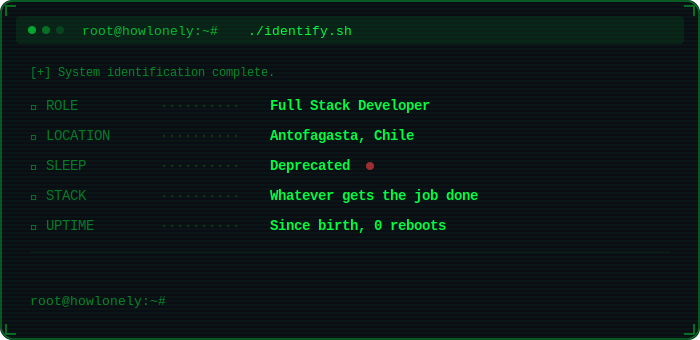

<div align="center">

<div align="center">
  
</div>


[](https://www.linkedin.com/in/ellian-troncoso/)
[](mailto:elliantroncoso@gmail.com)
[](https://github.com/HowLonely)

</div>

<!-- ════════════════════════ SEPARATOR ════════════════════════ -->

<p align="center">
  
</p>

```python
# root@howlonely:~# cat /etc/profile.conf

class HowLonely:

    def __init__(self):
        self.location       = "Santiago, Chile 🇨🇱"
        self.current_work   = "controlworldms.cl"
        self.languages      = ["JavaScript", "TypeScript", "PHP", "Python"]
        self.frontend       = ["React", "Next.js"]
        self.backend        = ["Django", "Laravel"]
        self.devops         = ["Docker", "AWS", "Git"]
        self.status         = "Building systems at 2am ☕"

    def __str__(self):
        return "Always shipping code."

# EOF
```

<p align="center">
  
</p>

### `[root@howlonely]# ls -la /etc/tech-arsenal/`

```
total 11
drwxr-xr-x  4 root root  4096 Feb 08 02:00 .
drwxr-xr-x  3 root root  4096 Feb 08 02:00 ..
drwxr-xr-x  2 root root  4096 Feb 08 02:00 languages
drwxr-xr-x  2 root root  4096 Feb 08 02:00 frameworks
drwxr-xr-x  2 root root  4096 Feb 08 02:00 devops
```

<div align="center">

**`-rwxr-xr-x  ./languages/*`**


**`-rwxr-xr-x  ./frameworks/*`**


**`-rwxr-xr-x  ./devops/*`**


</div>

<p align="center">
  
</p>

### `[root@howlonely]# cat /var/log/active-projects.log`

<table>
<tr>
<td width="50%">

```
┌──────────────────────────────────┐
│ PID 1337                         │
│ PROCESS  controlworldms.cl       │
│ STATUS   Running ●               │
│ TYPE     Work                    │
│ UPTIME   Active                  │
└──────────────────────────────────┘
```

> Custom-built business management system tailored to company-specific workflows & operations.
>
> `PHP` `Laravel` `Blade` `AWS`
>
>

</td>
<td width="50%">

```
┌──────────────────────────────────┐
│ PID 1338                         │
│ PROCESS  Control Flota           │
│ STATUS   Running ●               │
│ TYPE     Personal                │
│ UPTIME   Active                  │
└──────────────────────────────────┘
```

> Fleet management system — full stack solution built from scratch.
>
> `Python` `Django` `TypeScript` `React` `Next.js`
>
> [](https://github.com/HowLonely/backend-control-flota) [](https://github.com/HowLonely/frontend-control-flota)

</td>
</tr>
</table>

<p align="center">
  
</p>

### `[root@howlonely]# git log --streak`

<div align="center">


</div>

<p align="center">
  
</p>

### `[root@howlonely]# history --graph`

<div align="center">


</div>

<p align="center">
  
</p>

<div align="center">


</div>
